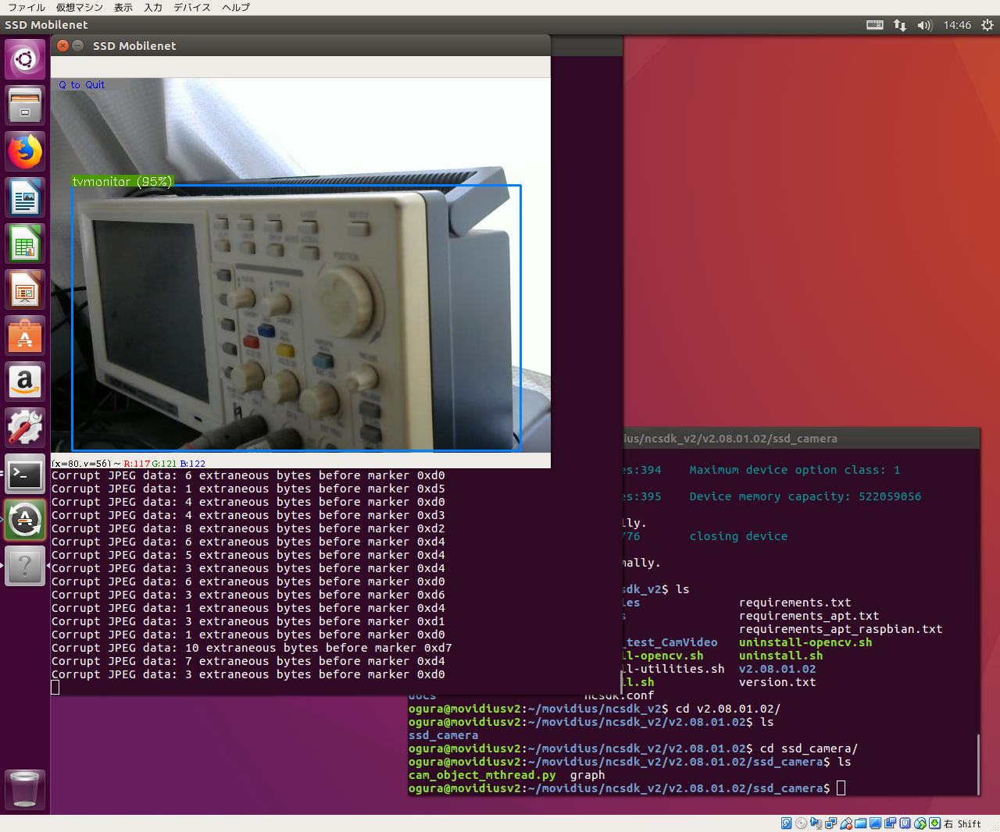
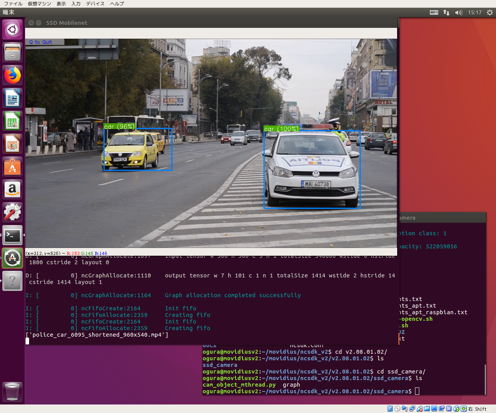

# NCSDK v2.08.01.02 with Ubuntu 16.04 on CentOS7 PC  

# For RaspberryPI+NCSDK_v2.08.01.02 is [Here](RaspberryPiModelB+.md)

## NCSDK_v2.08.01.02 Full Installation On Desktop PC
***Full Installation :***  
On Desktop PC having High Power Performace, you should use NCSDK Full Installation.  
Full Installation of NCSDK ***can generate graph file*** from prototxt and caffemodel. 
Full Installation of NCSDK includes API-Library for NCS, and install Caffe and Tensorflow Frameworks and Some pre-trained DNN models like TinyYolo, SSD, Inception etc.  
Installation of Frameworks and some pre-trained models depend on other web site contents, so you may fail installation.  

Install Ubuntu 16.04 onto VirtualBox **over 50GB vdi** and add ***USB-Filter discription as 03e7 and 040e for NCS*** with VirtualBox Manager.  
Booting Ubuntu on VirtualBox.  

First step is that upgrade ubuntu.  
```
$ apt update
$ apt upgrade
```
Download NCSDK.  
```
$ git clone https://github.com/k5iogura/ncsdk_v2
```
Install ncsdk **full**  
```
$ cd ncsdk_v2 ; make install ; make install;
$ tail -1 ~/.bashrc
export "PYTHONPATH=${PYTHONPATH}:/opt/movidius/caffe/python"
# pip3 list | grep tensorflow
tensorflow(1.9)
// reinstall 1.5
# pip3 uninstall tensorflow
# pip3 install tensorflow==1.5
$ bash
```
***You need twice "make install".***  
***You must be into new "bash" to update PYTHONPATH.***  
***You must use "tensorflow"==1.5 because tesnsorflow>1.5 cause Illegal Instruction Error(Seg.V) since having AVX Optimizaion Code.***
```
$ make examples
```
If you're lucky man then no error. If not, but **leaving error messages in this phase is OK**.  
**Say hello to NCS device**
```
$ python3 examples/apps/hello_ncs_py/hello_ncs.py
```
## [API-Library Only Installation On RaspberryPI-3B+ Boad](RaspberryPiModelB+.md)  

## Neural Compute Stick development general workflow  
- generate graph file by mvNCCompile tool on Desktop PC.
- python3 script predict using image and graph files show result.

python3 script include steps,
- open NCS devicess
- load graph file and meke graph opject
- load tensor image into graph object
- issue graph.GetResult()
- show result of prediction

## Object detection via UVC Camera

```
$ cd ncsdk_v2/v2.08.01.02/ssd_camera/
$ python3 cam_object_mthread.py
```
"graph" file is generated from SSD_MobileNet caffemodel for NCSDK_V2. **Graph file format of NCSDK_v1 and NCSDK_v2 are not Compatible**, so that need to compile model and prototxt by mvNCCompile for NCSDK_v2  
  
NCS recognizes my Ocsillo Scope as "TVmonitor";-)
- asynchronous prediction and loading images.  
- Single NCS **3.79FPS**  
- Video playback **11.26FPS**
- actual camera resolution: **640.0 x 480.0**  
- 300x300 Neural Network input size  

## Object detection of Video
Tested sample bellow,
```
$ cd ncsdk_v2/v2.08.01.02/ssd_video/
$ python3 video_objects_mthread.py
```
  

- asynchronous prediction and loading images.  
- Single NCS **5.83FPS**  
- Video playback **17.63FPS**
- actual video resolution: **960.0 x 540.0**  
- 300x300 Neural Network input size  
Nov.02.2018  
