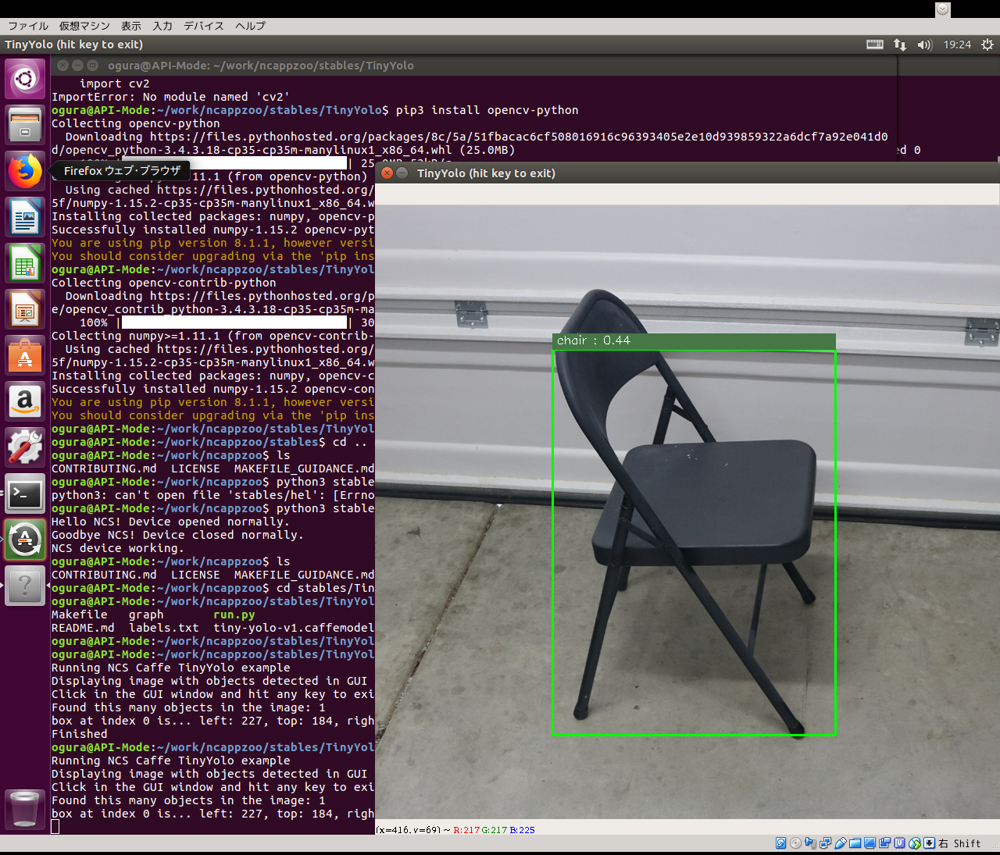
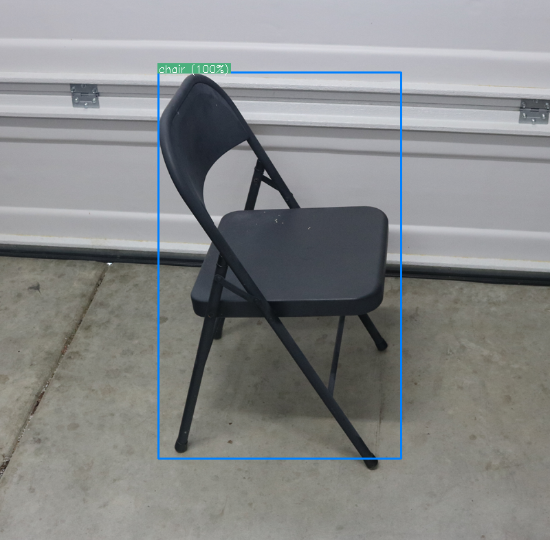
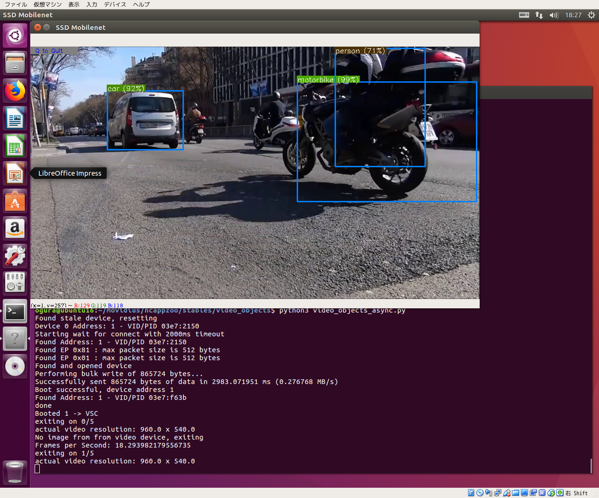

# NCSDK v1.12.01.01 with Ubuntu 16.04 on CentOS7 PC and xenial on ARM boad

## NCSDK Full Installation On Desktop PC
***Full Installation :***  
On Desktop PC having High Power Performace, you should use NCSDK Full Installation.  
Full Installation of NCSDK ***can generate graph file*** from prototxt and caffemodel. 
Full Installation of NCSDK includes API-Library for NCS, and install Caffe and Tensorflow Frameworks and Some pre-trained DNN models like TinyYolo, SSD, Inception etc.  
Installation of Frameworks and some pre-trained models depend on other web site contents, so you may fail installation.  

Install Ubuntu 16.04 onto VirtualBox and add ***USB-Filter discription as 03e7 and 040e for NCS*** with VirtualBox Manager.  
Booting Ubuntu on VirtualBox.  

First step is that upgrade ubuntu.  
```
$ apt update
$ apt upgrade
```
Download NCSDK and NCAPPZOO.  
```
$ git clone https://github.com/k5iogura/ncsdk
$ git clone https://github.com/k5iogura/ncappzoo
```
Install ncsdk full.  
```
$ cd ncsdk ; make install ; make install;
$ tail -1 ~/.bashrc
export "PYTHONPATH=${PYTHONPATH}:/opt/movidius/caffe/python"
$ bash
```
***You need twice "make install".***  
***You must be into new "bash" to update PYTHONPATH.***  
```
$ make examples
```
If you're lucky man then no error.  

Next, ncappzoo.  
```
$ cd ncappzoo
$ cd make all
```
You'll meet many error because NCSDK depend on as is many data files.  

How to try ncappzoo **step by step** is bellow,  
about checking connection with NCS,  
```
$ cd apps/hello_ncs_py ; python3 hello_ncs.py
```
About tiny-YOLO,
```
$ cd caffe/TinyYOLO ; make run
```
About ResNet-18,  
```
$ cd caffe/ResNet-18 ; make run
```
About SqeezeNet,  
```
$ cd SqeezeNet ; make run
```

These caffe samples execute downloading prototxt and caffemodel file onto current directory and issue "python3 run.py" command line. Example on SqeezeNet, after execution "make run", directory included bellow,  
```
deploy.prototxt zero_weights.caffemodel squeezenet_v1.0.caffemodel
synset_words.txt graph  etc.
```
## API-Library Only Installation On ARM Based Boad  
**Notice : Mandatory reboot ARM CPU Board with inserted NCS into USB Port**  
*NCS not work with HotPlug*

***API-Library Only Installation :***  
On weak CPU like ARMs, you should use NCSDK API-Mode Only.  
In API-Mode ***can not generate graph file, but*** can use graph file and ***can execute prediction*** with NCS.
API-Mode is placed at ncsdk/api/src. Setup will end only issue "make install" command with a few seconds. You'll get NCS API-Library ***"libmvnc.so"*** in /usr/local/lib etc.  
```
# apt install -y git
$ git clone https://github.com/k5iogura/ncsdk
$ git clone https://github.com/k5iogura/ncappzoo

# apt install -y libusb-1.0
# apt install -y python3-pip python-pip
$ pip3 install opencv-python
$ pip3 install opencv-contrib-python
$ pip3 install numpy
$ cd ncsdk/api/src

# make install
NCSDK FW successfully installed
cc -O2 -Wall -pthread -fPIC -MMD -MP -I. -I../include -I/usr/include/libusb-1.0  -c usb_boot.c -o obj-armv7l/usb_boot.o
cc -O2 -Wall -pthread -fPIC -MMD -MP -I. -I../include -I/usr/include/libusb-1.0  -c usb_link_vsc.c -o obj-armv7l/usb_link_vsc.o
cc -O2 -Wall -pthread -fPIC -MMD -MP -I. -I../include -I/usr/include/libusb-1.0  -c mvnc_api.c -o obj-armv7l/mvnc_api.o
cc -shared obj-armv7l/usb_boot.o obj-armv7l/usb_link_vsc.o obj-armv7l/mvnc_api.o -o obj-armv7l/libmvnc.so.0 -lpthread -lusb-1.0 -ldl
ln -fs obj-armv7l/libmvnc.so.0 libmvnc.so
ln -fs obj-armv7l/libmvnc.so.0 libmvnc.so.0
mkdir -p /usr/local/include/
mkdir -p /usr/local/lib/
cp obj-armv7l/libmvnc.so.0 /usr/local/lib/
ln -fs libmvnc.so.0 /usr/local/lib/libmvnc.so
cp ../include/*.h /usr/local/include/
mkdir -p /usr/local/lib/mvnc
cp mvnc/MvNCAPI.mvcmd /usr/local/lib/mvnc/
mkdir -p /etc/udev/rules.d/
cp 97-usbboot.rules /etc/udev/rules.d/
mkdir -p /usr/local/lib/python3.5/dist-packages
mkdir -p /usr/local/lib/python2.7/dist-packages
cp -r ../python/mvnc /usr/local/lib/python3.5/dist-packages/
cp -r ../python/mvnc /usr/local/lib/python2.7/dist-packages/
udevadm control --reload-rules
udevadm trigger
ldconfig

$ ls -la /usr/local/lib/libmvnc*
/usr/local/lib/libmvnc.so -> libmvnc.so.0 
/usr/local/lib/libmvnc.so.0  
```
You get,  
- API-Library libmvnc.so in /usr/local/lib.  
- python3.x I/F in /usr/local/lib/python3.5/dist-packages/  
- python2.7 I/F in /usr/local/lib/python2.7/dist-packages/
- C headers in /usr/local/include/
- USB Rules in /etc/udev/rules.d/  
NCSDK has use ***udev***, please be carefully.  

First on ncappzoo directory, ***check connection with NCS***
```
$ python3 ncappzoo/stable/hello_ncs_py/hello_ncs.py
Hello NCS! Device opened normally.
Goodbye NCS! Device closed normally.
NCS device working.
```
The Above message indicate that connection with NCS completely ended.  

***opencv-python for python3 :***  
Before next step, prepare opencv for python3.  
Raspbian *strech* has opencv-python and opencv-contrib-python packages for python3 on its repository.  
While if you used *xenial* then you must build opencv and contrib from source.  
Bellow is how to build opencv and contrib on DE10Nano xenial.  
```
$ apt install -y build-essential git cmake pkg-config libjpeg-dev libtiff5-dev  
$ apt install -y libjasper-dev libpng12-dev libavcodec-dev libavformat-dev  
$ apt install -y libswscale-dev libv4l-dev libgtk2.0-dev libatlas-base-dev gfortran

$ git clone https://github.com/Itseez/opencv
$ git clone https://github.com/Itseez/opencv_contrib

$ cd opencv         ; git checkout 3.2.0 ; cd ..
$ cd opencv_contrib ; git checkout 3.2.0 ; cd ..
$ mkdir -p opencv/build ; cd opencv/build
$ cmake \
     -D CMAKE_BUILD_TYPE=RELEASE \
     -D CMAKE_INSTALL_PREFIX=/usr/local \
     -D INSTALL_PYTHON_EXAMPLES=ON \
     -D OPENCV_EXTRA_MODULES_PATH=~/opencv_contrib/modules \
     -D ENABLE_NEAON=ON \
     -D BUILD_EXAMPLES=OFF ..
$ make ; make install
$ python3 -c "import cv2"
```
It takes 6hours on DE10Nano, woUuh...  

Next, ***check TinyYOLO object detection***  
**Notice :** "tiny-yolo-v1.caffemodel" files is splitten into 50MB files .01 and .02, so must merge 2files.  
```
$ cd ncappzoo/stable/TinyYolo
$ cat tiny-yolo-v1.caffemodel.0* > tiny-yolo-v1.caffemodel
$ python3 run.py
```

0.44 chair, no bad.  

Next, ***check SSD_MobileNet object detection***  
```
$ cd ncappzoo/stable/SSD_MobileNet
$ python3 run.py
```

1.00 chair, great.  

***references***  
- [人工知能 画像認識システム「Pidentifier」を、ラズパイとMovidius でサクッと作ってみた](https://www.rs-online.com/designspark/ai-powered-identification-with-the-pidentifier-jp?&intcmp=JP-WEB-_-Pi-DS2-_-Mar-18-_-Pidentifier)

## Neural Compute Stick development general workflow  
- generate graph file by mvNCCompile tool on Desktop PC.
- python3 script predict using image and graph files show result.

python3 script include steps,
- open NCS devicess
- load graph file and meke graph opject
- load tensor image into graph object
- issue graph.GetResult()
- show result of prediction

## Video prediction
Tested sample bellow,
```
$ cd ncappzoo/stable/Video_objects
$ python3 video_objects_async.py
```
  

- asynchronous prediction and loading images and skip 2 frames.  
- 18FPS( Prediction 8FPS )  
- Single NCS  
- actual video resolution: 960.0 x 540.0  
- 300x300 Neural Network input size  
Oct.29.2018  
