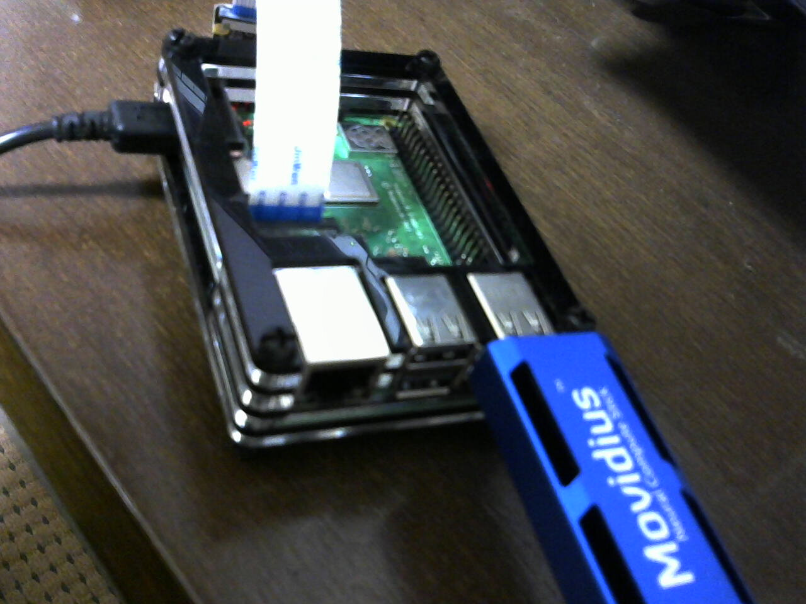
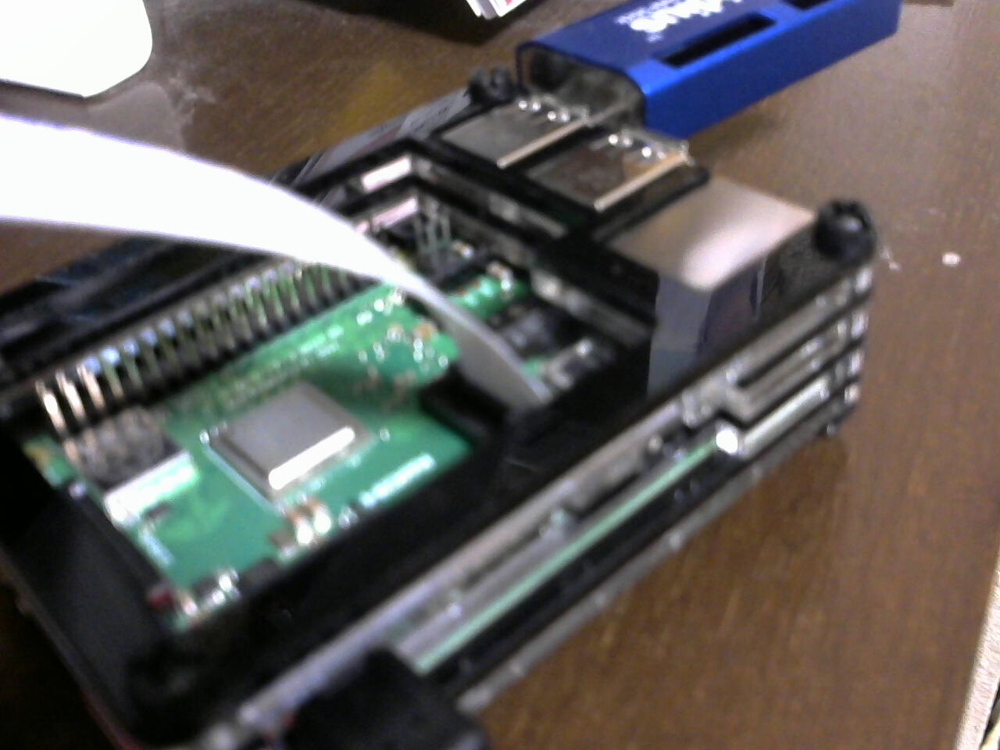

# CSI Camera Setup on RaspberryPI-3

### *prepare*  
- RaspberryPI-3 Model B or B++  
  Install raspbian stretch.  
  Setup network connection or HDMI Display, keyboard and mouse.  
  
- element14 CSI Camera  

### Attatch element14 on RaspberryPI-3 board  

  
  

## Check from RaspberryPI-3 console  

```
# raspi-config
Interfaceing Options -> Camera -> 
  Would you like the camera interface to be enabled?
  Yes -> OK
  Reboot? -> Yes
$ vcgencmd get_camera
supported=1 detected=1
```
supported: means that raspi-config support csi camera  
detected : means raspi detected csi camera

If ether supported nor detected not 1 then failed csi camera support.  

### Check still shot and video recording

```
// take still
$ raspistill -o photo1.jpg
$ eog photo1.jpg
// take movie
$ raspivid -o video.h264 -t 5000
// playback
$ omxplayer video.h264
```
omxplay not work, don't warry it.  

### numpy interface via imutils

According to many Web comments, use libatras, use libopenblas, liblapack to enhance numpy performance. But after installing picamera[array] **numpy was not correctlly working**. so that I operated bellow,
```
$ apt install libopenblas-base libopenblas-dev
$ pip3 uninstall picamera[array]
$ pip3 uninstall numpy==1.13
$ pip3 install picamera
$ pip3 install imutils
$ python3 -c "from imutils.video import VideoStream"
```
After of above pip3 or apt operations, run sample program bellow,  
```
// save bellow as vid.py
from picamera.array import PiRGBArray
from picamera import PiCamera
import time
import cv2
 
camera = PiCamera()
camera.resolution = (320, 240)
camera.framerate = 32
rawCapture = PiRGBArray(camera, size=(320, 240))
 
# allow the camera to warmup
time.sleep(0.1)
 
count = 0
# capture frames from the camera
for frame in camera.capture_continuous(rawCapture, format="bgr", use_video_port=True):
    # grab the raw NumPy array representing the image, then initialize the timestamp
    # and occupied/unoccupied text
    t1 = time.time()
    image = frame.array
 
    # show the frame
    cv2.imshow("Frame", image)
    key = cv2.waitKey(100) & 0xFF
 
    # clear the stream in preparation for the next frame
    rawCapture.truncate(0)
 
    if key == ord("q"):
        break
    count += 1
    t2 = time.time()
    if count >= 33:
        fps = count / ( t2 - t1 )
        print("%.3f %d / %.6f"%(fps,count,(t2-t1)))
        count = 0
```

Issue python3 command with "vid.py".  
```
$ python3 vid.py
321.706 33 / 0.102578
321.400 33 / 0.102676
```
**Over 321FPS?**  
In spite of given Nmsec parameter for cv2.waitKey is **100msec!**  
I suppose that
- **picamera module read raw data from camera HW(element14)  verry fast.**  
- **queue of picamera module save raw data.**  
- **cv2.imshow is slower than queuing speed of picamera.**  
- **As a result picamera queue is full always and stack data of past long time.**  
- **therefore make queuing speed slow.**  

**If Nmsec was 1 then latency of playback is verry long such as 2sec but frame rate is verry big! Try to assign Nmsec 1.**  

### Using VideoStream via imutils
Using imutils module VideoStream class would be used like cv2.VideoCapture module.  

```
// save bellow into "vs.py" 
from imutils.video import VideoStream
from imutils.video import FPS
import numpy
import cv2
import time

vs = VideoStream(usePiCamera=True).start()
time.sleep(1)
fps= FPS().start()

while True:
    img = vs.read()
    cv2.imshow("Video", img)
    if cv2.waitKey(100) != -1: break
    fps.update()
fps.stop()
vs.stop()
cv2.destroyAllWindows()

print("%.6f"%(fps.elapsed()))
print("%.2f"%(fps.fps()))
```
Issu python3 command,
```
$ python3 vs.py
14.932845
9.17
```

As same as previous sample given Nmsec is 100. By this parameter latency is verry short but frame rate is little such as 9.17FPS.  

### Conclusion  
**You can involve cv2 and picamera into your app together.**  

- Should use picamera **via imutils**. This is easy way to implement CSI camera and **same efficiancy** against using picamera.array module.  
- **Give big parametor such as 100 to cv2.waitKey function**, it will perform low latency playback. It is important feature for **real time app**.  
 
- If you **want to high through put** app then **give little parametor such as 1** to cv2.waitKey function. You can get hight FPS even though long latency.  
Nov.04.2018
