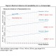

# VL53L1X IR 1D-Depth Sensor on Python of RaspberryPi stretch

## VL53L1X  


- STのVL53L1Xレーザ測距センサのキャリア/ブレークアウトボード
- 940 nmクラス1レーザの統合
- 解像度：1 mm /範囲：4-400 cm
- プログラム可能な関心領域（ROI）および2.8Vリニアレギュレータを搭載  
- I2C IF
- Average power consumption at 10 Hz with 33 ms timing budget  20mW  

  



## Python Programing I/F
[pypi.org/VL53L1X](https://pypi.org/project/VL53L1X/)  

vl53l1x distance sensor driver for Raspberry Pi  
```
$ pip3 install vl53l1x smbus2
```
Follow below simple flow,  
```
// python
import VL53L1X
tof = VL53L1X.VL53L1X(i2c_bus=1, i2c_address=0x29)
tof.open()                          # Initialise the i2c bus and configure the sensor
tof.start_ranging(1)                # Start ranging, 1 = Short Range, 2 = Medium Range, 3 = Long Range
distance_in_mm = tof.get_distance() # Grab the range in mm
tof.stop_ranging()                  # Stop ranging
```
