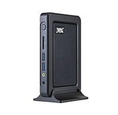
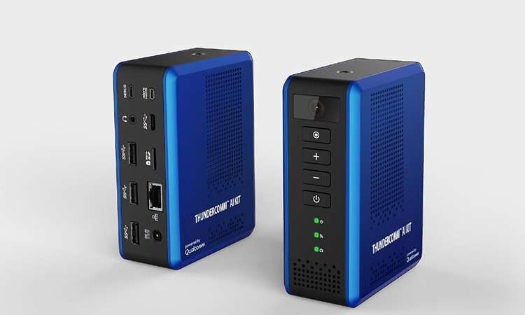
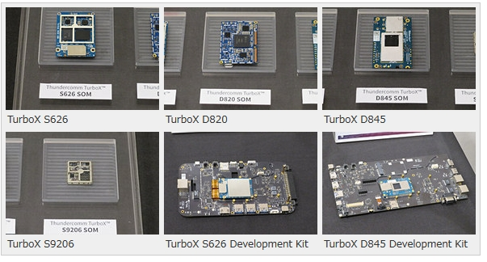
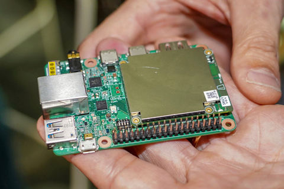

# Status of Other AI Chip Products

### [VIA SOM-9X20 SOMモジュール](https://www.viatech.com/ja/boards-ja/modules/som-9x20/)

#### SnapDragon 820e GPU
- Qualcomm® Snapdragon™ 820Eエンベデッドプラットフォーム
- 4K @ 60fps、8 x 1080p @ 30fpsをサポートする**Qualcomm® Adreno™ 530 GPU
- 内蔵Wi-Fi 802.11a/b/g/n/ac、Bluetooth 4.1およびGPS
- MXM 3.0 314ピンコネクタを備えたコンパクトフォームファクタモジュール
- VIA エッジAI 開発キットフィーチャーモジュール、キャリアボード、オプションの13MPカメラ
- Android 8.0 BSP
- Yocto 2.0.3に基づくLinux BSPは、今年6月にリリース予定です

### [Thundercomm TurboX AI Kit](https://www.thundercomm.com/app_en/index)

### Qualcomm SDA845プロセッサ

- 強力なコンピューティングプラットフォーム：オンデバイスのAI（CPU：8x Kryo 385 @ 2.8GHz、GPU：Adreno 630、DSP：Hexagon 685）に最適なヘテロジニアスコンピューティングアーキテクチャのクアルコムSDA845プロセッサ※、4kをサポートするビジュアルプロセッシングサブシステム@ 60fpsのビデオキャプチャと表示、AIアルゴリズム用の高品質画像をサポートするデュアル14ビットISP
- 柔軟なビジュアルソリューション：USB3.0カメラを搭載したMIPI Ultra HDカメラを内蔵し、IPカメラ（RTSPストリーミング）をサポートしています。これにより、開発者と顧客は選択したカメラを使用できます。
- 最適化されたAIソフトウェア：TurboX AI Kitには、クアルコムAIエンジンが搭載されています。このエンジンには、Qualcomm®Neural Processing SDKと、顔認識やオブジェクト検出などの高性能推論機能を実現するAndroid NN APIのサポートが含まれています。Qualcomm AIエンジンは、Open Neural Network Exchange（ONNX）インターチェンジ形式を使用して、Tensorflow、Caffe / Caffe2、およびその他のフレームワークをサポートしています。
- AIアプリケーション開発ツール：オンライン開発ツールを使用すると、開発者は簡単かつ迅速に独自のAIアプリケーションを作成できます。
- さまざまなサードパーティサービス：Amazonビデオキネシスストリーミング、Microsoft Azureなどのさまざまなクラウドコンピューティングサービスプラットフォームをサポートし、業界情報、リサーチ、分析を提供します。

#### [Google TPU](https://cloud.watch.impress.co.jp/docs/news/1134852.html)

Only announce by google detail information is not available.

Dec.12.2018
