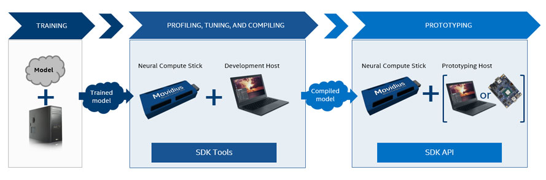
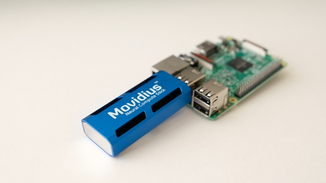
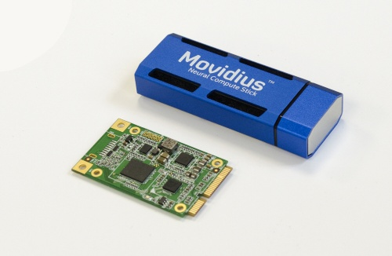
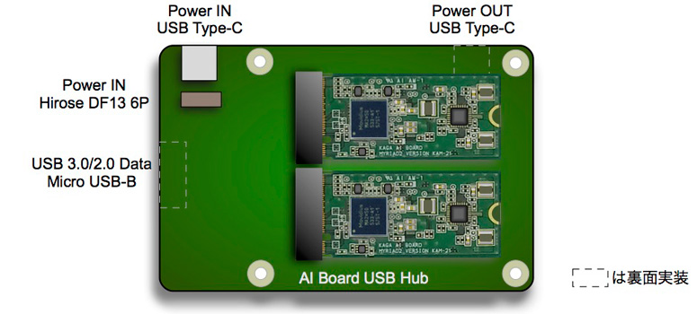
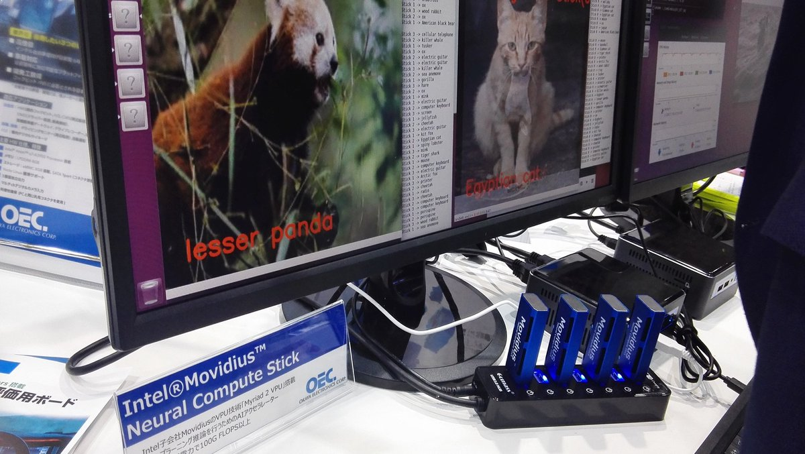
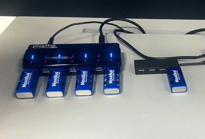
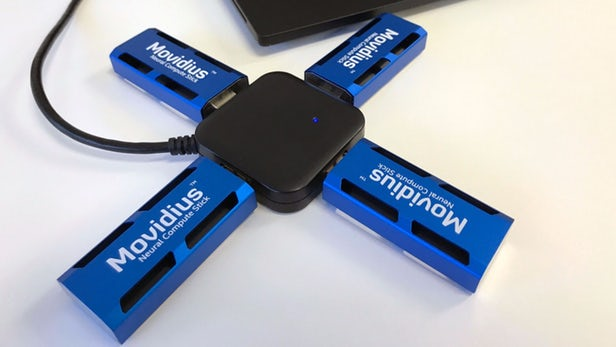
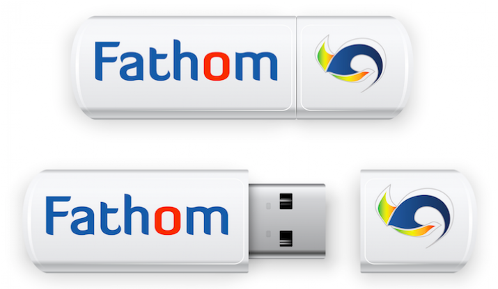
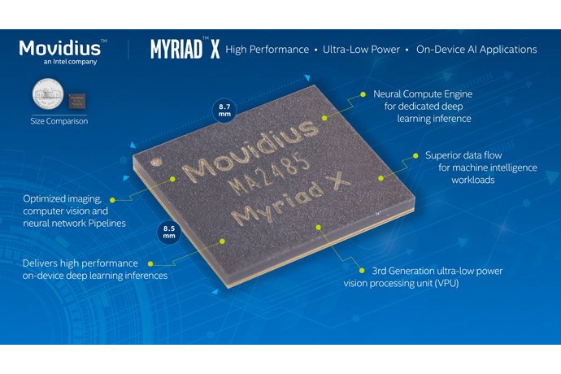
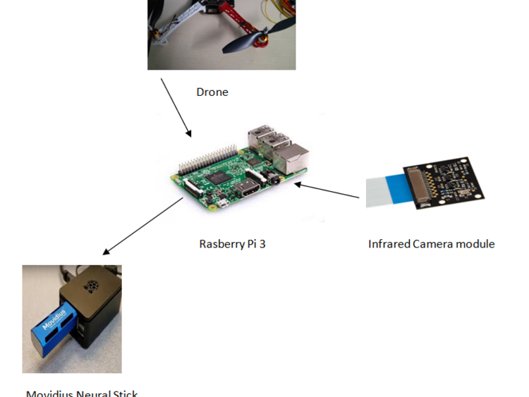

# Status movidius now

### **Use Case from Movidius HP**  

### **With Raspberry Pi ModelB**

### **Kaga-denshi**  

### **NCS x 4 sticks on SelfPower HUB**  

### **Movidius Neural Compute Sticks**
Fathom  

Myriad X  

### **Drone**

### **High Power Use**

