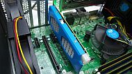

# Status movidius now
Nov.21.2018  from google  
**Movidius 2nd Generation NCS2(MyriadX)**  

### MyriadX Chip View  

### [NCS2 on Drone](https://www.slashgear.com/intel-neural-compute-stick-2-artificial-intelligence-ncs-usb-stick-price-performance-14553676/)

### [Certification via face  recognistion](http://monoist.atmarkit.co.jp/mn/articles/1811/16/news059.html)

**ET2018**

Nov.04.2018  from google  
**Movidius 1st Generation NCS(Myriad2)**    
### **Use Case from Movidius HP**  

### **With Raspberry Pi ModelB**

### **Kaga-denshi**  

### **NCS x 4 sticks on SelfPower HUB**  

### **Movidius Neural Compute Sticks**  
Fathom  

Myriad X    

### **Drone**  

### **High Power Use**

